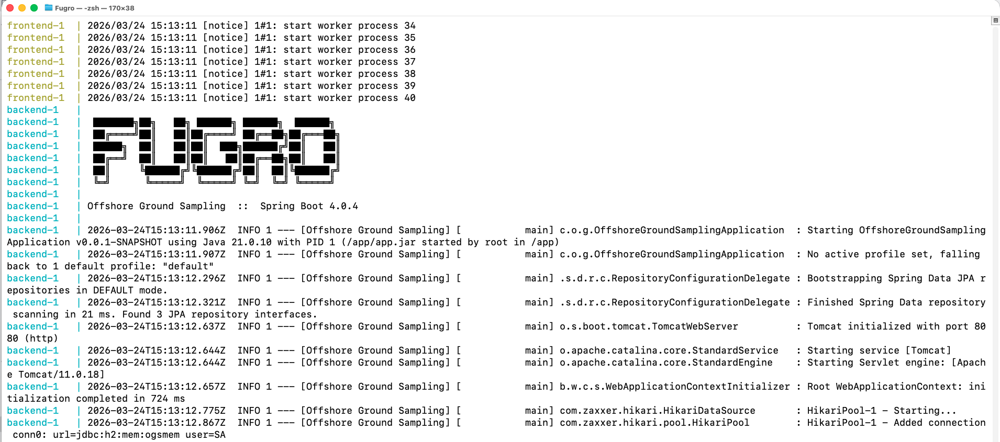
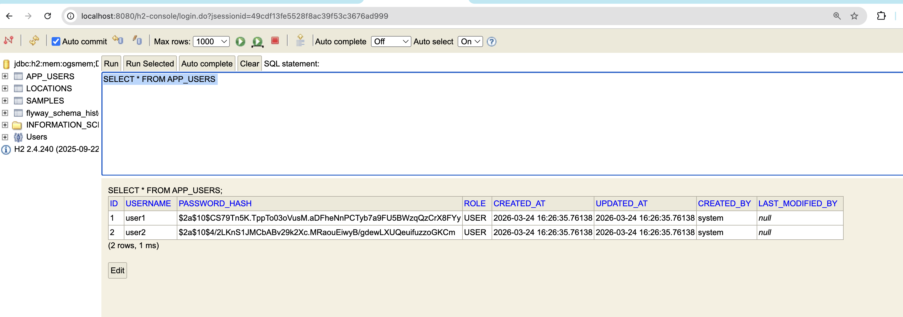
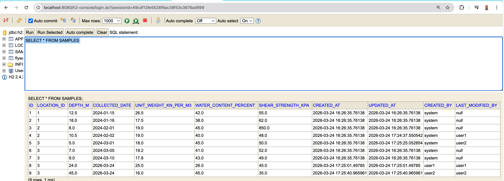

# Offshore Ground Sampling

This repository was created as a home assignment for Fugro.

It is a demo full-stack application for offshore ground sampling. Users can access the application without logging in and browse sample data in read-only mode. Through the landing page, authenticated users can log in and manage soil samples, including adding, editing, and deleting records.


## Stack
| Layer | Technology |
|-------|------------|
| API | Java 21, Spring Boot 4 (Web MVC, JPA, Security, Validation), Flyway, H2 |
| Auth | JWT (jjwt), BCrypt-backed users |
| UI | React 18, TypeScript, Vite 5 |
| Ops | Docker Compose, GitHub Actions |

## Quick start (Docker)

From the repository root:

```bash
docker compose up --build
```

**Ports**

| Service | Host URL |
|---------|----------|
| React app | [http://localhost:8080](http://localhost:8080) |
| Swagger UI | [http://localhost:8081/swagger-ui.html](http://localhost:8081/swagger-ui.html) |
| H2 console | [http://localhost:8081/h2-console](http://localhost:8081/h2-console) |


**H2 (Docker or local JVM)**

- JDBC URL: `jdbc:h2:mem:ogsmem;DB_CLOSE_DELAY=-1;DB_CLOSE_ON_EXIT=FALSE`
- User: `sa`, password: *(empty)*

The database is **in-memory**; restarting the backend wipes data and reapplies Flyway **`V1`** (schema) and **`V2`** (seed). `application.yml` enables **`web-allow-others: true`** on the H2 console so it works through Docker port mapping.

## Local development

**Backend** — Java 21, Maven wrapper included:

```bash
cd backend
./mvnw test
./mvnw spring-boot:run
```
**H2 (Docker or local JVM)**

- JDBC URL: `jdbc:h2:mem:ogsmem;DB_CLOSE_DELAY=-1;DB_CLOSE_ON_EXIT=FALSE`
- User: `sa`, password: *(empty)*

The database is **in-memory**; restarting the backend wipes data and reapplies Flyway **`V1`** (schema) and **`V2`** (seed). `application.yml` enables **`web-allow-others: true`** on the H2 console so it works through Docker port mapping.

**Frontend** (pointing at the local API on 8080):

```bash
cd frontend
npm ci
npm run dev
```

| Service | Host URL |
|---------|----------|
| React app | [http://localhost:5173/](http://localhost:5173/) |
| Swagger UI | [http://localhost:8080/swagger-ui.html](http://localhost:8080/swagger-ui.html) |
| H2 console | [http://localhost:8080/h2-console](http://localhost:8080/h2-console) |



## Demo users

| User | Password |
|------|----------|
| `user1` | `password1` |
| `user2` | `password2` |

User passwords are stored in app_users table as **BCrypt** hashes.



## Security model (demo)

- **GET** under `/api/**` is anonymous (browsing).
- **POST / PUT / DELETE** on samples require `Authorization: Bearer <token>` from **`POST /api/auth/login`**.

## Architectural decisions

The project is built as a single Spring Boot backend and a React (TypeScript, Vite) frontend. The backend uses Spring Web MVC, Spring Data JPA with the repository pattern (JpaRepository interfaces for locations, samples, and users), Hibernate as the JPA provider, Flyway for schema and seed data, and an in-memory H2 database. Validation is done with Bean Validation on DTOs. JUnit is used for tests. API documentation is exposed through springdoc-openapi and Swagger UI.

JWT authentication is implemented with Spring Security and jjwt: POST /api/auth/login accepts credentials and returns an access token; sample create, update, and delete require a Bearer token. GET routes under /api/** stay open so the UI can browse data without logging in.

Summary statistics include mean water content and a count of samples where any of unit weight, water content, or shear strength exceeds the configurable thresholds in [application.yml](backend/src/main/resources/application.yml) (sampling.threshold).

Entities extend a base AuditEntity with **Spring Data JPA auditing (created_at, updated_at, created_by, last_modified_by)**, driven by AuditingEntityListener and an AuditorAware tied to the logged-in user.



## Testing
Backend tests use JUnit Jupiter, Mockito, MockMvc, and @SpringBootTest (controller tests mock services; the repository test hits H2 with Flyway). They live under backend/src/test/java.

```bash
cd backend
./mvnw test
```
## CI
On every pull request, GitHub Actions runs mvn -B test in backend. See [.github/workflows/ci.yml](.github/workflows/ci.yml)